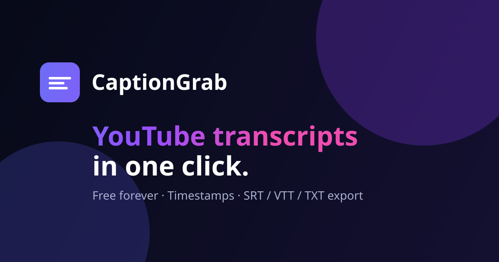

# CaptionGrab — Free YouTube Transcript & Caption Extractor

Paste any YouTube link and get a clean, timestamped transcript you can **search, read, copy and
export** (TXT, SRT, VTT, JSON). Free forever, no sign-up, no API keys.



## ✨ Features

- **One-link extraction** — watch URLs, Shorts, live replays, embeds, `youtu.be` links, bare ids
- **True timestamps** — click any line to jump the video to that moment
- **In-transcript search** with match highlighting and counts
- **Export anywhere** — plain text, timestamped text, SubRip (`.srt`), WebVTT (`.vtt`), JSON
- **170+ languages** — every caption track listed, with smart auto-translate fallback you can
  switch off (then a missing language is a clear error, not a silent substitution)
- **Read & watch together** — side-by-side player plus a distraction-free reading mode
- **Private local history** — reopen past extractions offline; nothing ever leaves your browser
- **Dark / light themes**, fully responsive, keyboard- and screen-reader-friendly

## 🏗️ Architecture

```
Browser (React + Vite + Tailwind, deployed on Vercel)
        │  GET /api/video?id=…  ·  GET /api/transcript?id=…&lang=…
        ▼
Cloudflare Worker API  (worker/, edge-cached, rate-limited, zero secrets)
        │  Innertube player API + timedtext (server-side, no CORS issues)
        ▼
      YouTube
```

| Concern | Choice | Why |
|---|---|---|
| Frontend | React 18, Vite, Tailwind, shadcn/ui → **Vercel** | Fast, typed, accessible component base |
| API | **Cloudflare Workers** | Server-side transcript fetch (browsers are CORS-blocked), edge cache, no servers to run |
| Secrets | None required | No YouTube Data API key, no OAuth, nothing to leak |
| Storage | Browser `localStorage` only | History & settings stay on-device; no database needed |

> **Why does a backend exist at all?** Browsers cannot fetch YouTube transcripts directly
> (CORS), and the YouTube Data API's `captions.download` endpoint requires OAuth — an API key
> alone can never download captions. The Worker resolves caption tracks and downloads
> transcripts server-side, which is the only architecture that actually works. See
> [`docs/ARCHITECTURE.md`](docs/ARCHITECTURE.md).

## 🚀 Quick start

**Prerequisites:** Node.js 20+, npm. For the API: a (free) Cloudflare account + `wrangler`.

```bash
# 1. Install frontend dependencies
npm install

# 2. Start the frontend (http://localhost:8080)
npm run dev

# 3. Optional — start the real Worker API in a second terminal (http://127.0.0.1:8787)
npm run worker:dev
```

`/api/*` is served by the real Worker whenever it is running. If it is not reachable, the dev
server answers from a bundled **offline demo library** (`dev/demoLibrary.ts`) so every path in the
UI still works with no Cloudflare account and no network access to YouTube. Those responses are
flagged `demo: true`, the header shows a **Demo mode** status dot, and the transcript is labelled —
nothing is passed off as live data. The demo path still runs the production transcript code
(`worker/src/transcript.ts`: track selection, translate fallback, json3 parsing).

Copy [`.env.example`](.env.example) to `.env` only if you want to point at a deployed Worker.

## 🧪 Checks

```bash
npm run typecheck   # TypeScript project references
npm run lint        # ESLint
npm run test        # Vitest unit tests (URL parsing, formatters, exporters)
npm run build       # Production frontend build → dist/
```

## ☁️ Deployment

Full walkthrough: **[docs/DEPLOYMENT.md](docs/DEPLOYMENT.md)**.

1. **API:** `cd worker && npx wrangler login && npm run deploy` → note the
   `https://captiongrab-api.<subdomain>.workers.dev` URL.
2. **Frontend (Vercel):** import the repo, set env var
   `API_WORKER_URL=https://captiongrab-api.<subdomain>.workers.dev`, deploy.
   `vercel.json` rewrites same-origin `/api/*` to the Worker and adds security headers.

## 📁 Repository map

```
├── src/
│   ├── components/        # Extractor, CaptionDisplay, HistoryPanel, Header/Footer, landing/*
│   │   └── motion/        # Reveal · Magnetic · Spotlight · CountUp · Marquee · ScrollRail
│   ├── contexts/          # SettingsContext · HistoryContext (shared local state)
│   ├── hooks/             # use-mobile, use-toast
│   ├── lib/               # api.ts · youtube.ts · format.ts · motion.ts (motion toolkit)
│   ├── pages/             # Index, About, Privacy, Terms, NotFound
│   └── config/apiConfig.ts
├── worker/src/index.ts    # Cloudflare Worker API (video + transcript routes)
├── worker/src/transcript.ts  # Pure parsers + track selection (unit-tested)
├── vite/devApi.ts         # DEV ONLY: /api proxy → Worker, else offline demo fallback
├── dev/demoLibrary.ts     # DEV ONLY: demo scripts emitted as real json3 timedtext
├── docs/                  # ARCHITECTURE.md · DEPLOYMENT.md
├── vercel.json            # Rewrites (/api → Worker, SPA fallback) + security headers
└── public/                # favicon, og-image, poster fallback, sitemap, robots
```

## 🔌 API contract

| Route | Params | Notes |
|---|---|---|
| `GET /api/health` | — | `{ ok, demo?, degraded? }` — drives the header status dot |
| `GET /api/video` | `id` | Metadata + every caption track |
| `GET /api/transcript` | `id`, `lang`, `translate` | `translate=0` makes a missing language a `404 LANGUAGE_UNAVAILABLE` instead of silently serving another track; `translate=1` (default) falls back to English + machine translation |

## 🔒 Security & privacy

- No API keys ship in the client — the exposed keys from the old version were removed.
- `vercel.json` ships `X-Content-Type-Options`, `X-Frame-Options`, `Referrer-Policy` and a
  restrictive `Permissions-Policy`.
- The Worker validates video ids, rate-limits per IP, sets CORS headers and never logs content.
- History and settings live in `localStorage` only. See [Privacy Policy](/privacy) in-app.

## ⚖️ Fair use

Transcripts belong to the video's creator. Short quotes with attribution are usually fine;
republishing full transcripts without permission is not. The app reminds users of this on every
transcript. CaptionGrab is not affiliated with YouTube or Google.

## 🤝 Contributing

Issues and PRs welcome. Please run `npm run typecheck && npm run lint && npm run test` before
opening a PR.

## 📄 License

MIT — see [LICENSE](LICENSE).
